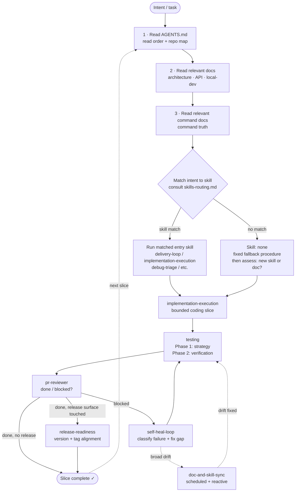
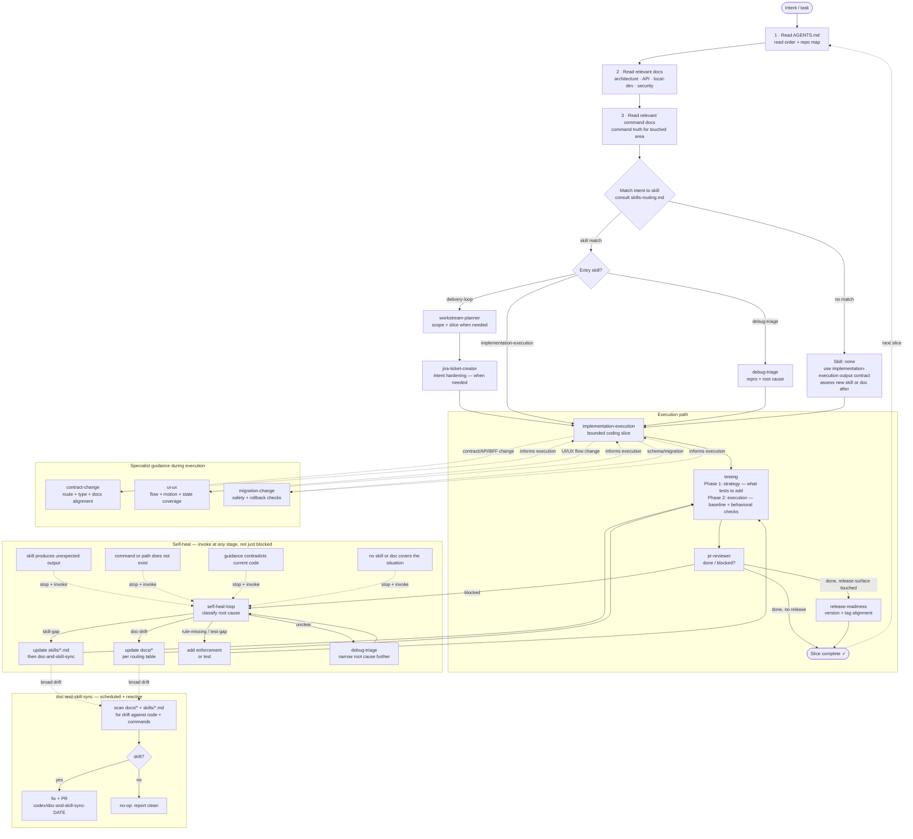

# Agent Harness

This document describes the end-to-end delivery loop for this repository and for repositories generated from it. It shows how intent turns into a bounded change, verification, review, and durable harness correction when guidance drifts.

Skills are reusable workflow helpers inside the harness. `delivery-loop` is the normal execution entry point for implementation work; the harness is the broader control flow that decides when planning, testing, review, release checks, and self-heal apply.

The default route is:

- implement-now requests -> `delivery-loop`
- planning or sequencing requests -> `workstream-planner`
- debug-first requests -> `debug-triage`
- review or done-gate requests -> `pr-reviewer`
- no clear skill match -> `Skill: none`

## Loop Diagram

The diagrams below are current for the intended process flow. They describe the expected routing and recovery model, but enforcement is still partly procedural:

- machine-enforced today: tests, lint, docs validation, and any other checks already wired into module command surfaces
- process-enforced today: skill selection, self-heal invocation, and promotion of repeated issues into docs/skills

That means this file is up to date as a process contract, not a guarantee that every step is mechanically enforced.

## Governance Change Rule

If a change makes a behaviorally meaningful modification to harness-governance files such as `AGENTS.md`, `docs/skills-routing.md`, this document, `.github/*` assistant instructions, or `skills/*/SKILL.md`, run the lightweight regression check in `docs/harness-evaluation.md` in the same slice.

### Overview

### Full detail

## Loop Phases

| Phase               | Owner                                            | Entry condition                           | Exit condition                          |
| ------------------- | ------------------------------------------------ | ----------------------------------------- | --------------------------------------- |
| Orient              | —                                                | Any new task                              | Relevant repo guidance and commands read |
| Skill selection     | `docs/skills-routing.md`                         | Post-orient                               | Skill named or `Skill: none` declared   |
| Scope + slice       | `workstream-planner` (via `delivery-loop`)       | Scope unclear or cross-module             | One bounded slice chosen                |
| Bounded execution   | `implementation-execution`                       | Slice defined                             | In-scope files only, stop condition met |
| Specialist guidance | `contract-change` · `ui-ux` · `migration-change` | Change surface triggers during execution  | Alignment checks complete               |
| Testing             | `testing`                                        | Execution complete                        | Baseline + behavioral checks pass       |
| Review              | `pr-reviewer`                                    | Verification evidence ready               | `done` or `blocked` verdict             |
| Release             | `release-readiness`                              | Deployable module changed                 | Version/tag alignment confirmed         |
| Self-heal           | `self-heal-loop`                                 | Any failure, mismatch, or gap — any stage | Permanent fix applied or ticketed       |
| Sync                | `doc-and-skill-sync`                             | scheduled run or self-heal trigger        | Docs and skills match repo truth        |

## Cross-Module Scope Rule

Sourced from `skills/implementation-execution/SKILL.md`. A slice should stay single-module by default. Cross module boundaries only when one of these is true:

| Condition | Modules forced into scope |
| --- | --- |
| A shared contract or model changes | All modules that directly consume that contract |
| An API or proxy contract changes | Contract owner plus every direct caller or mapper |
| A job payload or async schema changes | Producer and consumer modules |
| A release version or deployment surface changes | Every deployable module whose shipped behavior changed |

In all other cases: split into separate slices and flag adjacent work as deferred items.

## Skill: none Fallback

Sourced from `docs/skills-routing.md`. When no skill matches, the agent must:

1. State explicitly: `Skill: none — proceeding with repo conventions.`
2. Read the relevant repo guidance and command surface before writing any code.
3. Scope to a single module unless a cross-module boundary is forced (see rubric above).
4. Apply the `implementation-execution` output contract: restate outcome, name in/out-of-scope files, define stop condition.
5. Run baseline checks for every touched module.
6. Re-route to a matching skill if the change touches routes, contracts, migrations, or release surfaces.
7. Invoke `self-heal-loop` if a gap or mismatch is discovered during execution.
8. After completing: assess whether this scenario warrants a new skill or doc, and wire it into the routing table and `AGENTS.md` if so.

## Maintenance

* `doc-and-skill-sync` can run on a schedule or reactively when broad drift is found.
* `self-heal-loop` is the reactive equivalent — triggered at any stage, not just on `pr-reviewer` blocked.
* `AGENTS.md` is the entry point. This file is the process diagram. They must stay aligned.

## Self-Heal Artifact

Every `self-heal-loop` invocation should leave behind a concrete remediation artifact:

- rule/test/check update
- skill update
- docs correction
- or an explicit follow-up ticket with rationale when the fix cannot land in the current slice

## Current Limitation

The harness still depends on the agent following the routing and self-heal rules. When a step becomes repeatedly important and machine-detectable, prefer promoting it into:

- docs validation
- lint/test enforcement
- a module command
- or a tighter skill contract

Until then, harness-governance changes should use `docs/harness-evaluation.md` as the manual regression backstop.
