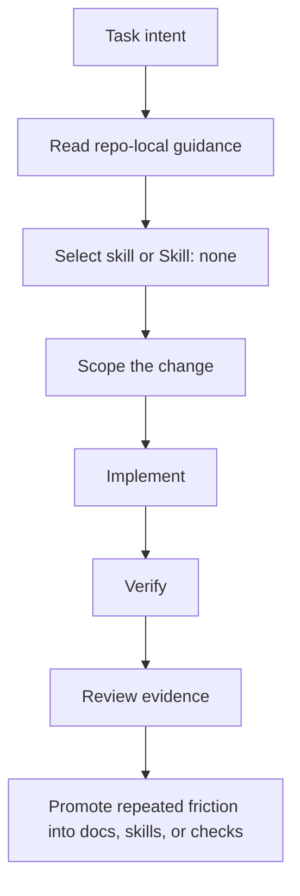

# Harness Architecture

The harness is intentionally file-based and lightweight.

## Layers

1. `AGENTS.md` - repo map, read order, and source-of-truth rules.
2. `docs/` - durable process, planning, testing, and review guidance.
3. `skills/` - reusable workflow instructions for recurring task types.
4. `workbench/` - ignored scratchpad pattern for temporary task notes.
5. `.github/` - optional assistant pointers and validation workflow templates.
6. `scripts/` - optional validation helpers.

## Operating Model

## Boundary

The harness should describe how work is controlled and reviewed. It should not define a target repository's application architecture. Add application-specific architecture docs only after copying this harness into the target repo.
